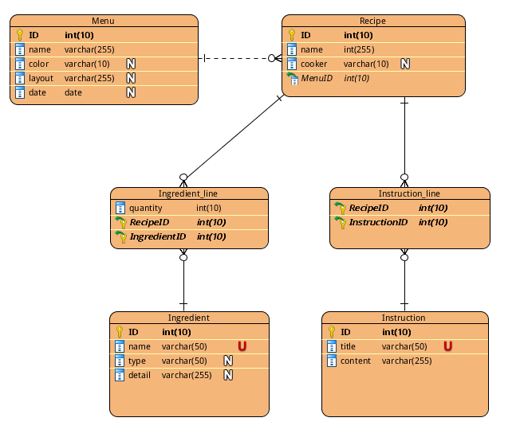

# Cookpad General
## 1. Network programming and Object-Oriented Design
Consider a RESTful Web API that returns a representation of a User in JSON. Write a program which, given a user ID (integer) as input, will output a list of the names of the user's friends and friends-of-friends.

### Prerequisites

The program was built based on `python` source code. So the machine should contain `python` library, and the program should be run on the Unix system.


### A. Running the program on Unix

The default repository contains the file named `User.sh`, and which is the executing file of the program. Just type:

```
sh User.sh user_id
```
The result of the request will be printed on the screen. 

For example:

```
sh User.sh 1
```
This means you want to see the result of user ID 1.


```
sh User.sh 5
```
This means you want to see the result of user ID 5.

### B. Running the program directly via `python` source code

If you want to execute the program through python source code in the default repository, Just type:
  

```
python code/user_parser.py user_id
```
The result of the request will be printed on the screen. 

For example:

```
python code/user_parser.py 1
```
This means you want to see the result of user ID 1.


```
python code/user_parser.py 5
```
This means you want to see the result of user ID 5.


### Output

The screen will display the result of your query.
If you type:

```
sh User.sh 1
```
The output will be printed like this:

```
For the user ID: 1
Name: Austin

Friend list:
----------------------------------
Brandon
has friend named Hannah
----------------------------------
Edward
has friend named Dan
----------------------------------
```
### Design and Evaluation

The program was built only on the one source code named `user_parser.py`. Which imported library `json`, `requests`, and `sys`.

1. The `json` library was used for parse json format text.

2. The `requests` library was used to construct the connection with website `http://fg-69c8cbcd.herokuapp.com/user`.

3. The `sys` was used to parse the input userid argument.

The reason why I design the program like is this because the requirements were easy to be met only by network connection. And the json library can help reading the response in json format in the fast way. As a result, just 50-line code can achieve the goal and make it look clear and neat. By the way, the userID should be range from 0 to 10.


## 2. Database Design

Consider a system for storing recipes that uses a relational database. This database needs to store menus consisting of recipes, and the ingredients and instructions for each recipe. Menus are composed of many recipes. Recipes are composed of many ingredients and instructions.

### ERD Diagram
------

 

## SQL code

The `Database.sql` in the code directory. Please check the file to see the SQL building code.

### Design and Evaluation
------

**Menu**

has columns ID, name, color, layout, and the date. The ID indicated that each ID should menu should be tracted.

**Recipe**

has columns ID, name, cooker, and returning menuID. The returning MenuID means one menu can have many recipes.

**Ingredient**

has columns ID, name, type, and detail. The name is unique because two same ingredients should not be existed at the same time.

**Ingredient line**

has quantity, recipe ID and IngredientID. The reason why I built the table because there is going to have two recipes having same ingredient. In order to avoid duplicate ingredient, I made this table to indicate different recipes may have different quantity of the same ingredients, and which looks user-friendly.

**Instruction**

has columns ID, title, and content. The name is unique because two same instruciton should not be existed at the same time.

**Instruction line**

has recipe ID and IngredientID. The reason why I built the table because there is going to have two recipes having same instruction. In order to avoid duplicate instruction, I made this table to indicate different recipes may have the same instructions, and which looks user-friendly.


